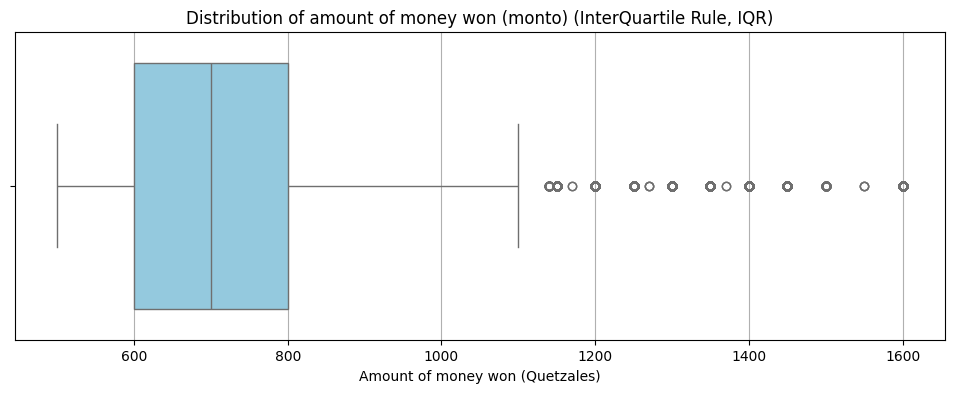
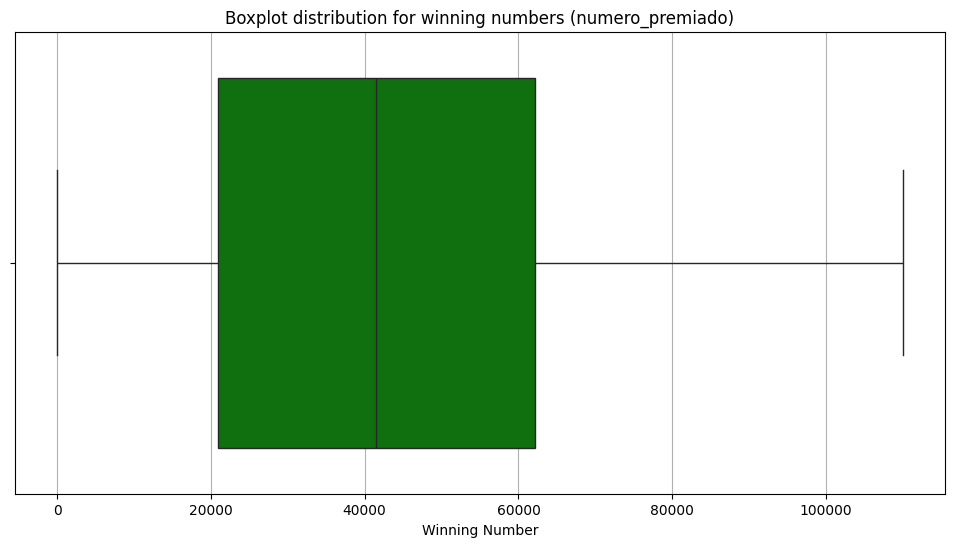
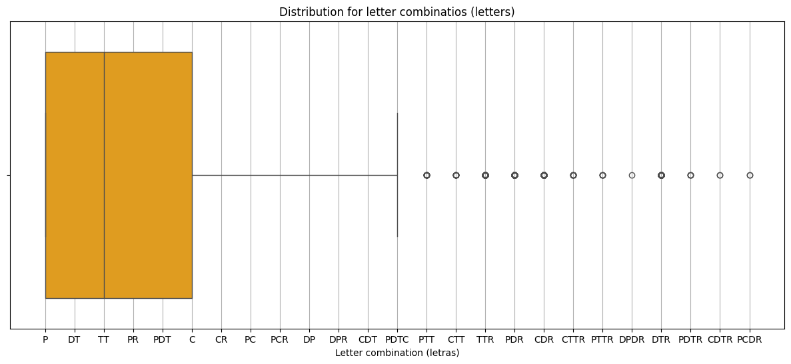
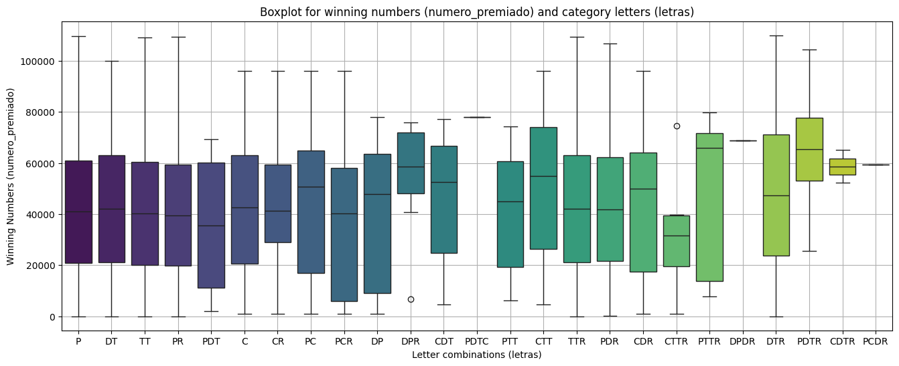
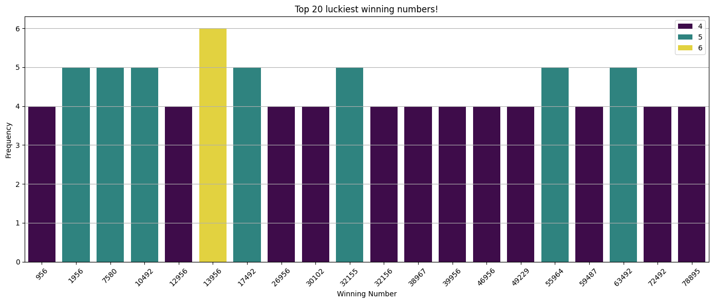
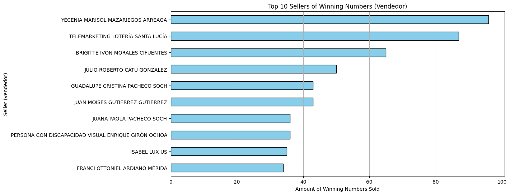
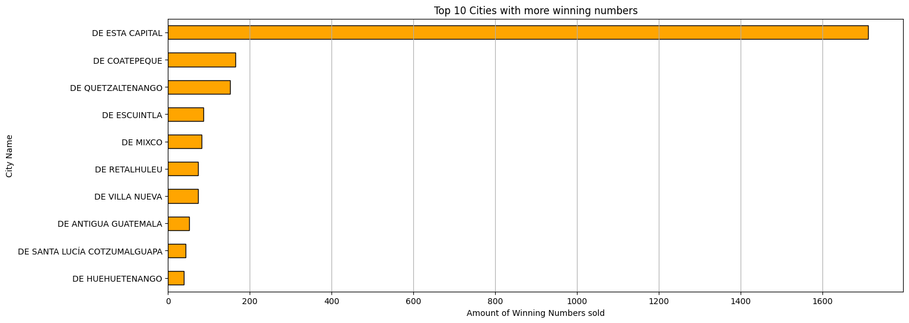
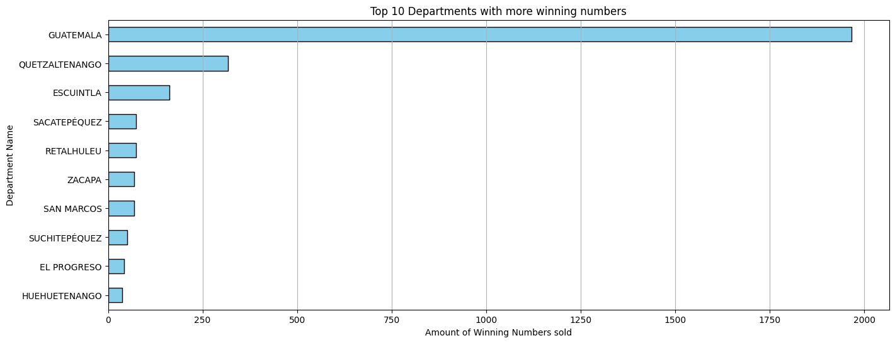

# End-to-End Data Pipeline for Santa Lucía Lottery: Historical Data Mining, Web Scraping, ETL, and Dynamic Visualization

## **Description:** 

In this project I tried to answer and discover insights about **"Loteria Santa Lucia de Guatemala"** which is the biggest lottery in my country (Guatemala). Also to create a historical dataset for their winnig number, due to the fact that there is no way to retrieve the old data from the past draws.

## **Table of contents**

Pending...

## **Why of this project?**

Lotería Santa Lucía is the largest and oldest lottery in Guatemala, founded in 1956. Unfortunately, there is no way to retrieve historical data other than through old physical newspapers, some Facebook videos (available only since 2018), or by purchasing old newspapers (PDFs) from the "National Newspaper Archive of Guatemala," which is very expensive (I tried it...).

Once a draw expires, the data is permanently erased. There is no way to perform any kind of audit on "Lotería Santa Lucía." Surprisingly, no thesis projects or university studies from Math or Statistics students have been conducted on this topic. Additionally, there is no dataset available on platforms like Kaggle.

Due to all these factors, I found a valuable way to provide data that no one else has, which could be interesting for those interested in statistics and Machine Learning.


## **Automated ETL Process for Loteria Santa Lucia Data**

### Introduction

This project focuses on automating the ETL (Extract, Transform, Load) process for Santa Lucia Lottery data. The main goal is to efficiently collect, clean, and store data to enable analysis and visualization, highlighting insights such as winning patterns, frequently rewarded locations, and more.

### ETL Architecture

The ETL process consists of three primary stages:

1. **Extraction:** Retrieving raw lottery data from the web.

2. **Transformation:** Cleaning, structuring, and enriching the data.

3. **Load:** Storing the processed data into a database and locally for further use.

Below is a high-level overview of the workflow:

> [Extract raw data from the web] --> [Transform into structured datasets] --> [Load into AWS RDS]


### Extract Phase 

**Overview**

* **Tool Used:** Selenium with Python.
* **Purpose:** Scrape lottery data from the Santa Lucia lottery website.
* **Process:**

    * Open the lottery awards website.
    * Navigate to the desired draw information using a lottery ID.
    * Extract header and body data (prizes, winning numbers).
    * Save the extracted content to a .txt file for processing.

**Example**

* **Input:** Lottery number 208
* **Output:** File `results_raw_lottery_id_208.txt` stored in `./Data/raw/`

**Related Code:**

* File: `extract.py`
* Sample Function: 
    ```
    def extract_lottery_data(lottery_number, output_folder):
        # Scrapes data and saves it to a .txt file
        pass
    ```

### Transform Phase 

**Overview**

* **Tool Used:** Pandas
* **Purpose:** Convert raw data into clean and structured datasets.
* **Process:**
    
    1. **Header Processing:**
        * Extract metadata (e.g., draw number, type, dates, main prizes, and reintegros(refounds)).

    2. **Body Processing:**
        * Extract detailed prize data, including seller information, cities, and amounts.
    
    3. **Data Cleaning:**
        * Split complex columns (e.g., `reintegros`).
        * Replace missing values.
        * Validate and format data types.

**Related Code:**

* File: `transformer.py`
* Sample Function: 

```
def transform(folder_path, output_folder):
    # Reads raw data, cleans it, and saves structured CSVs
    pass
```

### Load Phase

**Overview**

* **Tool Used:** pymysql, AWS Secrets Manager
* **Purpose:** Upload processed data to a MySQL database hosted on AWS RDS.
* **Process:**

    1. Retrieve database credentials securely using **AWS Secrets Manager**.
    2. Establish a connection to the database.
    3. Insert data into the relevant tables (Sorteos and Premios) in batches.

**Outputs**

* Data successfully uploaded to **AWS RDS.**

**Related Code:**

* File: `loader.py`
* Sample Function:

```
def load_csv_to_table(connection, csv_file, table_name):
    # Inserts data from CSV into a MySQL table
    pass
```

### Results

* The processed data enables:

    * Identification of patterns in winning numbers.
    * Analysis of frequently rewarded locations.
    * Visualization of trends and insights.

### Future Steps

1. Automate the ETL pipeline using **Cron Jobs** and **AWS EC2** or **AWS Lambda Functions.**
2. Implement real-time data visualization using tools like **AWS Quicksight** or **Dash.**
3. Explore predictive models to analyze patterns in winning numbers.
4. Expand automation to handle new lottery types and regions, like Mexico's National Lottery.


### Requisites

* Python libraries: `selenium`, `pandas`, `pymysql`, `boto3`
* AWS setup: **RDS instance** and **Secrets Manager**.
* Tools: ChromeDriver for Selenium.

### Conclusion

This automated ETL project demonstrates expertise in data extraction, transformation, and storage while showcasing potential for advanced analytics and visualization. It is a robust solution for managing lottery data efficiently.


## Insights and Findings from Visualizations (From June/01/2024 - January/05/2025)

### 1. What is the Distribution Prize of Loteria Santa Lucia? (InterQuartile Range) 🌟

* **Why Use IQR?**

    * The IQR method is robust against outliers, making it ideal for identifying anomalies in prize distributions.

    * Lottery prize data often contains extreme values (e.g., a small number of very high prizes). By focusing on the interquartile range, we can:

        * Isolate typical prize values (between the 25th and 75th percentiles).
        * Flag potential data errors or outliers for further review.

    * This method ensures a cleaner and more meaningful analysis of prize distributions.



So with this you can see that 50% of the prizes won are **between Q600.00 and almost Q800.00**
With a **median aprox of Q750.00**

I deciced to use the IQR (InterQuartile Rule) becuase the outliers of the "big prizes" are too high above 1,000,000 up to 5,000,000 making hard to see and understand where the mayor concentration is found.


### 2. What is the distribution of the Winning Numbers of Loteria Santa Lucia? 🌟



So, in the boxplot you can see that **50%** of winning numbers are located **between 21,000 and 62,000** aprox.
With a **median of 42,000**

When talking about winning numbers I mean a number that has won any amount of money from the range of Q500 up to Q5,000,000

### 3. What is the distribution for the Letter Combinations (letras) of Loteria Santa Lucia? 



**What does this mean?**

50% of all letter combinations are located in: P, DT, TT, PR, PDT and C

Each letter stands for: 

**P:** Premio (Prize, won some money like Q600)

**DT:** Doble terminacion (if any of the 3 winning places finsihed with "55" any number that also finished with "55" will get some money)

**TT:** Triple Terminacion (if any of the 3 winning places finsihed with "756" any number that also finished with "756" will get some money)

**PR:** Premio y Reintegro (Prize and Refund, won some money and you get again a new ticket for next lottery)

**PDT:** Premio y Doble Terminacion (Won some money and fished with the last 2 numbers as the 1st, 2nd or 3rd place)

**C:** Centena (If the 1st, 2nd or 3thd place has a number like "55049" any number between 55000 and 55100 will get some money)

### 4. So then what is the range of numbers that get those letter combinations? 



**What does this mean?**

Well, It means that the numbers with the letter comination for **"p"** a mostly located between **20,000** and **60,000** e.g. if you buy a ticket number with the number 40,000 good chances are that it will get the letter "p" (of course if you get some prize in lottery) 

Same with letter combination for **DT, TT, PR, PDT and C** this just confirm again that a lot of the prizes won are between the range of numbers **20,000** and **60,000**

# 5. From all winning numbers which one is the "Luckiest" one? 🌟

## This is maybe one of the best highlights of all my findings! 🧠💥



**What does this mean?**

In fact, this means that such numbers like: **13956** has won in **6 different times**, different prizes. Not necessary that won the first place but at least it won some money.

> ⚠️ IMPORTANT: Further Investigation Is Needed! 

Despite this might just `statistical noise` this might be also the `key for find a pattern` in this data. We only have 6 months old data but as the dataset grows the chances to find (or not) a patter for  the winning numbers also increase!

# 6. Top 10 sellers with more winning numbers 🌟

## Another very important finding! 



So Ms. **Yecenia Mazariegos** is the top seller of winning numbers, even on top of the web page "Telemarketing Loteria Santa Lucia"! 

This finding is very important, because **there is no record of the best sellers in loteria santa lucia at all**! Not even in their social networks, nothing! So, I'm the first into take a look to this very interesting insight!

Also, the cities for the top 10 sellers can be found [here](./notebooks/visualization_sorteos_premios.ipynb#top-10-sellers-location).


### 7. What is the top 10 of Guatemala's Cities with more winning numbers? 



**"De esta Capital" Means "Guatemala city"**

And as you may realize the amount of winning numbers sold in **Guatemala city is by far the largest** one in all Loteria Santa Lucia from **June 2024 up to today!**


Guatemala City has the largest winning numbers sold due to the huge amount of wholesellers and the web page. 

### 8. What is the top 10 departments with more winning numbers sold? 

> Guatemala is divided in the following way: 1 Country with 22 departments, 331 municipios and at least 1 or 2 "big cities" for each department. 



At department level, **Guatemala** is still the largest one with almost 2,000 winning numbers sold, by far followed by **Quetzaltenando** and **Escuintla**.


https://loteria.org.gt/site/award

### findings: 

1. By using the lottery id, I can iterate over the objects listed in the awards list.
by example here by using the id selector, is easy to look for the "Sortero Extraordinario N.390" because it has the `id=177`
Also in many cases is easy to guess what will be the next URL because all the "Sorteos Ordinarios" have a consecutive number like: `180`,`181`,`183`,`184`.
While the "Sorteos Extraordinarios" have these kind of numbers: `177`,`182`,`188`,`192`

So we will look for the new list awards by using the "id", 

2. 


Xpaths "Listado de premios" https://loteria.org.gt/site/award
<a href="/site/award-detail?id=177&amp;sorteo=390&amp;TipoSorteo=Extraordinario"></a>


working into the data base in AWS


Sorteos Extraordinarios have a max of 90,000 tickets sold for each lottery
Sorteos Ordinarios have a max of 80,000 tickets sold for each lottery


### At least in my investigation I saw that in 2025 Loteria Santa Lucia showed this message: 

¡Bienvenido!, de acuerdo a regulaciones de la Contraloría General de Cuentas y las regulaciones del Código Civil Decreto Ley Número 106, Artículo 2139, los sorteos se realizarán cuando se alcancen el 80% de la venta de los billetes emitidos.

Agradecemos la confianza en Lotería Santa Lucía.

Meaning: they are going to do the lottery only when they reach the 80% of the tickets sold. I did not see this in 2024